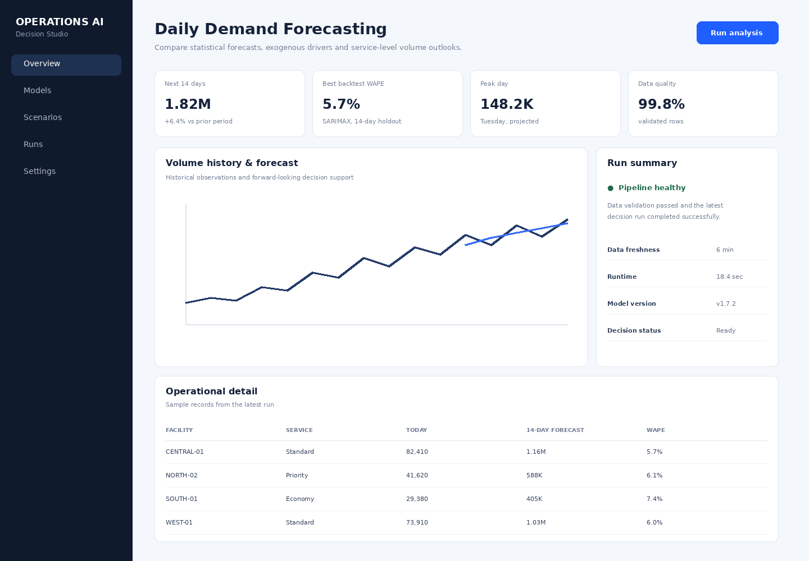

# Parcel Demand Forecasting Workbench

A tutorial-first, production-oriented forecasting repository for daily parcel and service demand. It uses **synthetic operational data** that resembles a national pickup, sorting and delivery network without reproducing any proprietary dataset. The project demonstrates how to move from exploratory time-series analysis to reproducible backtesting, model comparison, an API, a web dashboard, MLflow tracking and containerized deployment.



## What this project demonstrates

- Python time-series development with **ARIMA, SARIMA, SARIMAX and Prophet**.
- Exogenous forecasting with weather severity, promotion intensity and holiday indicators.
- Rolling/holdout backtesting using MAE, RMSE and WAPE rather than selecting a model from in-sample fit.
- A practical hierarchy: facility → service level → date.
- MLflow-ready experiment organization and a Databricks-notebook-compatible tutorial.
- FastAPI serving, React + TypeScript UI, Docker Compose, tests and GitHub Actions.

## Problem statement

Operational networks need a daily answer to a simple question: **how much work is likely to arrive at each facility and service level over the next one to several weeks?** Under-forecasting can produce backlog and missed service commitments; over-forecasting can overstaff the network and waste transportation capacity. This repository treats forecasting as a decision-support product rather than a notebook-only exercise.

## Synthetic dataset

`data/daily_parcel_volume.csv` contains two years of generated records with the following columns: `date`, `facility_id`, `service_level`, `parcel_volume`, `weather_severity`, `promotion_index`, `holiday_flag`, `day_of_week`, and `opening_backlog`. The generator intentionally introduces weekday seasonality, year-end peak demand, long-term trend, weather effects, promotion effects and noise.

Generate it with:

```bash
python src/generate_data.py
```

## Forecasting workflow

```text
Synthetic daily operations data
        |
        v
Validation + aggregation
        |
        v
ARIMA / SARIMA / SARIMAX / Prophet
        |
        v
Backtest + metric comparison
        |
        v
Selected forecast
        |
        +--> FastAPI
        +--> React dashboard
        +--> downstream capacity planning
```

### Why four forecasting approaches?

**ARIMA** is a strong baseline when autocorrelation and trend dominate. **SARIMA** explicitly models repeating weekly patterns. **SARIMAX** extends that formulation with external variables and is particularly useful when demand is partly explained by known operational drivers. **Prophet** is included as an accessible additive model for multiple seasonal effects and robust business-facing experimentation. The right model is selected by out-of-sample performance, not by brand or complexity.

## Run locally

```bash
python -m venv .venv
source .venv/bin/activate       # Windows: .venv\Scripts\activate
pip install -r requirements.txt
python src/generate_data.py
uvicorn app.api:app --reload --port 8000
```

Frontend:

```bash
cd frontend
npm install
npm run dev
```

Or, on a workstation with Docker:

```bash
docker compose up --build
```

## API examples

```bash
curl -X POST http://localhost:8000/forecast \
  -H 'Content-Type: application/json' \
  -d '{"facility_id":"CENTRAL-01","service_level":"standard","horizon":14,"model":"sarimax"}'
```

`POST /compare` runs a common holdout and returns MAE, RMSE and WAPE for candidate models.

## Productionization path

For a production deployment, store curated history in a Delta table, schedule data-quality checks and feature generation, track model runs in MLflow, register the approved model, expose forecasts through a versioned service, and monitor both forecast error and business outcomes such as backlog or excess scheduled capacity. Batch forecasts can be generated daily while the API serves scenario requests.

## Repository map

- `src/generate_data.py` – deterministic synthetic operational data generator.
- `src/forecast.py` – reusable statistical forecast and backtest functions.
- `app/api.py` – FastAPI prediction and model-comparison endpoints.
- `notebooks/01_forecasting_tutorial.py` – notebook-style tutorial compatible with Databricks source notebooks.
- `frontend/` – React + TypeScript dashboard.
- `tests/` – automated tests.
- `.github/workflows/ci.yml` – Python test and frontend build checks.

## Extension ideas

Add hierarchical forecast reconciliation, probabilistic quantiles, conformal intervals, drift monitoring, holiday calendars, weather APIs, and a feature store. A natural next step is to feed the forecast into a MILP capacity planner, which is demonstrated in the companion optimization repositories.

---


### Thank you for reading

#### Please consider giving a star if you find the repo useful. Thank you.

---

### **AUTHOR'S BACKGROUND**
### Author's Name:  Emmanuel Oyekanlu
```
Skillset:   I have experience spanning several years in data science, enterprise AI architecture and solutions, developing scalable enterprise data pipelines,
enterprise solution architecture, architecting enterprise systems data and AI applications,
software and AI solution design and deployments, data engineering, industrial intelligent vision systems, high performance computing (GPU, CUDA), machine learning,
NLP, Agentic-AI and LLM applications as well as deploying scalable solutions (apps) on-prem and in the cloud.

I can be reached through: manuelbomi@yahoo.com

Publications:  https://scholar.google.com/citations?user=S-jTMfkAAAAJ&hl=en
LinkedIn:  https://www.linkedin.com/in/emmanuel-oyekanlu-6ba98616
Github:  https://github.com/manuelbomi

```
[](https://skillicons.dev)


